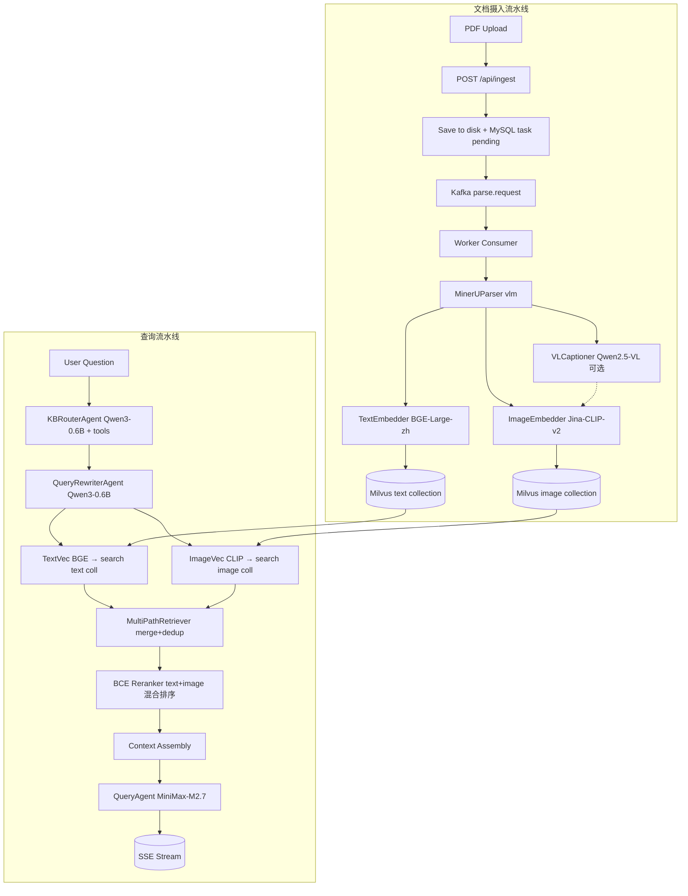

# multiDal — 多模态 RAG 系统架构设计

> 与代码同步的架构说明。代码即真相,文档只在结构层面做解释。

## 1. 项目背景

企业数字化转型中,核心知识资产不再局限于纯文本。PDF 报告、扫描件、财务图表、设计图稿等多模态文档需要深度语义理解。传统文本 RAG 与 OCR 的局限:

- **OCR 路线**:无法把握图表数据趋势、图像对象关系、复杂版面结构。
- **纯文本 RAG 路线**:对图、表中关键信息"睁眼瞎",用户问"去年 Q3 营收趋势"找不到那页折线图。
- **闭源多模态 LLM**:成本高、不可控、无法精细索引,做"以文搜图"很弱。

MultiDal 的目标:**摄入任意 PDF,提取文本 + 视觉内容,构建跨模态向量库,支持多知识库隔离的图文混合问答 + 会话记忆。**

## 2. 系统架构



## 3. 四阶段流水线

| 阶段 | 输入 | 处理 | 输出 |
|------|------|------|------|
| **Parser** | PDF 文件 | MinerU 云端 API(4 步:申请 URL → OSS 上传 → 轮询 → 下载 ZIP) | `ParsedDocument`(text_chunks + images + tables + full_text) |
| **Embedder** | `ParsedDocument` | 文本走 BGE-Large-zh-v1.5(1024d);图片走 Jina-CLIP-v2 双路(像素 + 描述) | `EmbeddedChunk[]` |
| **Store** | `EmbeddedChunk[]` | 写入 Milvus 双 Collection(物理隔离的 `{kb}_text` + `{kb}_image`) | 向量索引 |
| **RAG** | 用户问题 | KB 路由 → 改写 → 双路召回 → BCE-reranker → LLM 生成 | 带 sources 的 SSE 流式答案 |

驱动者: `pipeline/orchestrator.py` 的 `Orchestrator` 类,**只负责串接 Stage,不做业务**。

## 4. 项目结构

```
multiDal/
├── src/multidal/
│   ├── config/          # Pydantic Settings(configs/settings.yaml 单文件)
│   ├── schema/          # Pydantic 数据模型(跨阶段数据契约 + JSON 验证)
│   ├── pipeline/        # Stage 抽象基类 + Orchestrator 驱动器
│   ├── queue/           # Kafka producer / consumer(失败重试 + 指数退避)
│   ├── parser/          # MinerU 云 API 包装 + chart_detector
│   ├── embedder/        # Text(BGE) + Image(Jina CLIP, 双路) + VLCaptioner(可选)
│   ├── store/           # MilvusStore + MultiPathRetriever + Reranker
│   ├── db/              # MySQL 模型 + repository
│   ├── agents/          # BaseAgent → QueryAgent(主 LLM)
│   │                    # KBRouterAgent / QueryRewriterAgent(小模型 + tools)
│   │                    # sessions(MySQLSession) + tools(function_tool)
│   ├── kb/              # KBManager + IntentRouter/QueryRewriter(代理封装别名)
│   ├── llm/             # 小模型封装(供其他模块直接 import)
│   ├── api/             # FastAPI(ingest / status / query / kb / doc / sessions / health)
│   └── utils/           # 图片预处理、日志
├── configs/
│   └── settings.yaml    # 单一配置文件
├── frontend/            # Vue 3 + Vite 前端 SPA
├── docs/                # 调试复盘 / 简历材料
├── tests/
├── scripts/             # CLI 工具(ingest.py / query.py)
├── main.py              # uvicorn 启动包装
├── main_demo.py         # 集成测试入口(TestClient + --live)
├── docker-compose.yml
└── Dockerfile
```

## 5. 核心技术选型

| 组件 | 选择 | 说明 |
|------|------|------|
| 文档解析 | **MinerU (magic-pdf)** | 云端 API `https://mineru.net`,JWT 认证,4 步异步协议 |
| 文本 Embedding | **BGE large zh v1.5** | 1024 维,Moark API (`/embeddings`),并发批量 |
| 图片 Embedding | **Jina CLIP v2** | 1024 维,Moark API;每张图片产出像素 + 描述 2 条向量 |
| 图片描述增强(可选) | **Qwen2.5-VL-7B-Instruct** | Moark API,生成中文 caption 替代 MinerU 英文 caption |
| Rerank | **BCE reranker base v1** | Cross-encoder,Moark `sentence-similarity` API |
| 小模型(路由/改写/命名) | **Qwen3-0.6B** | Moark API,`enable_thinking=False` |
| 向量数据库 | **Milvus** | Docker,IVF_FLAT + IP 指标(向量归一化后等价 cosine) |
| 消息队列 | **Kafka** | 异步解耦上传与处理,失败重投 |
| 状态存储 | **MySQL** | 4 张表:`parse_tasks` / `knowledge_bases` / `agent_sessions` / `agent_messages` |
| Agent 框架 | **openai-agents SDK** | `Agent` + `Runner` + `function_tool` |
| LLM(问答) | **MiniMax-M2.7** | `https://api.minimaxi.com/v1` |
| 前端 | **Vue 3 + Vite** | Markdown / LaTeX / Mermaid / SSE 流式 / 会话管理 |
| 部署 | **Docker Compose** | 8 个服务一键起 |

## 6. 检索链路(查询流水线)

```
用户问题
  → KB 路由:
      - 手动指定 kb_ids → 直接用
      - 否则 KBRouterAgent(Qwen3-0.6B) → 看 KB 列表,可能调 search/get_doc_info 工具辅助判断
  → Query 改写(Qwen3-0.6B):原问题 + 1~2 个子问题,覆盖不同查询角度
  → 双路并行召回(每个 kb_id,每个子问题):
      A: BGE Embedding(1024d)→ Milvus {kb}_text collection
      B: Jina CLIP text encoder(1024d)→ Milvus {kb}_image collection
  → 合并去重(按 kb_id:chunk_id 唯一化,保留最高分)
  → BCE-reranker 精排:
      - 文本候选:调用 sentence-similarity API 重新打分
      - 图片候选:直接用 CLIP 召回分数(不调 rerank API,语义空间不同)
      - 全部候选统一排序,取 top-5
  → Context 拼装:[图片]/[文本] 标签 + kb_id + 页码 + 分数 + 内容
  → QueryAgent(MiniMax-M2.7)→ SSE 流式输出
```

**关键约束:只存在 A+B 两路召回,不存在 BM25 或"描述反查"路径。**

### 6.1 为什么文本和图片要分开 rerank

BGE 和 Jina CLIP 的向量空间完全不同,IP 分数**不可比**。强行按召回分合并排序,文本会"霸榜",图片全部出局(docs/debug_image_retrieval.md 有完整复盘)。

正确做法:文本调 BCE rerank 重打分,图片保留 CLIP 分数(它已经处于正确空间),**两类候选在精排阶段再次统一排序**。这样既保住了"以文搜图"的语义质量,又不会让图片被文本淹没。

## 7. 多知识库

- 每个 KB 对应 Milvus 中**物理隔离的**一对 Collection(`{kb_id}_text` + `{kb_id}_image`)
- MySQL `knowledge_bases` 表维护 KB 元数据(name / description / kb_id)
- `parse_tasks.kb_id` 关联文档与 KB,删除时级联清理 chunks
- 查询时支持:
  - 手动指定 `kb_ids` 列表(高优先级)
  - `auto_route=True` → Qwen3-0.6B 自动判断
  - `auto_route=False` → 退到"全量 KB"(防路由错时仍有答案)

## 8. 小模型架构(路由 / 改写 / 命名)

| 任务 | 实现 | 工具 |
|------|------|------|
| KB 路由 | `KBRouterAgent`(别名 `IntentRouter`) | `search_knowledge_base` + `get_doc_info` |
| 查询改写 | `QueryRewriterAgent`(别名 `QueryRewriter`) | 无(纯生成) |
| 会话命名 | `generate_session_name` | 无 |

**共同配置**:`_get_small_agent()` 工厂,`enable_thinking=False`,避免 CoT 拖慢响应。

**降级策略**:任何小模型调用失败 → 上层捕获并降级(路由失败用全量 KB,改写失败用原问题,命名失败用问题前 15 字)。

## 9. 图片双路编码

每张图片产生 **2 条向量** 写入 `{kb}_image` collection(物理同一 collection,`chunk_id` 区分):

| chunk_id | content | 向量来源 |
|----------|---------|----------|
| `img_xxx` | caption 文本(优先 Qwen2.5-VL → 兜底 MinerU caption → 兜底 "image page N") | Jina CLIP **image encoder**(像素→1024d) |
| `img_xxx_desc` | 同上 caption | Jina CLIP **text encoder**(文字→1024d) |

**为什么存 2 条**:CLIP 的 image encoder 和 text encoder 共享语义空间,同一条 query 文本能同时与两种向量比对。"以图搜图"走像素路径,"以文搜图"走描述路径,**一次 query 同时命中两种索引**。

`_load_image_uri`: 读图 → 缩放(最长边 168px) → JPEG q30 → base64 data URI → CLIP image encoder。

### 9.1 可选增强:VL Caption

MinerU 抽出的 caption 是英文,中文场景下召回质量差。接 `VLCaptioner`(Qwen2.5-VL-7B-Instruct)生成中文 caption,**显著提升"以文搜图"路径**。

降级链:`VLCaptioner` → `MinerU caption` → `"image page N"`。任何一步失败都回退到下一步,不会让 embedder 崩。

## 10. 会话管理

MySQL 两张表(与状态库同实例):

```sql
agent_sessions: session_id PK, session_name, created_at, updated_at
agent_messages:  id PK, session_id FK, message_data LONGTEXT(JSON), sources TEXT, created_at
```

- `MySQLSession` 实现 openai-agents SDK 的 `Session` 协议,业务层零感知切换
- 每条 assistant 消息的 `sources` 单独存(JSON 数组),前端按消息关联展示
- 首个问题回答完成后 → `generate_session_name` 用小模型起 3-10 字中文名
- 命名降级:模型失败 → 用问题前 15 字

## 11. 解析可靠性

`parse_tasks.status`: `pending → processing → completed / failed / exhausted`

- 失败:Worker 重新投递到 Kafka(退避 30s → 60s → 90s)
- 超过 `max_retries`(默认 3)→ `exhausted`,人工介入
- 端到端状态通过 `GET /api/ingest/{task_id}` 查询

## 12. 配置

**单文件** `configs/settings.yaml`,环境变量可覆盖:

| Section | 用途 |
|---------|------|
| `pipeline` | `top_k_recall`(10) / `top_k_final`(5) / `max_retries`(3) |
| `kafka` | `bootstrap_servers` / `topic` |
| `milvus` | `host` / `port` |
| `db` | MySQL 连接信息 |
| `mineru` | `api_base` / `api_token` / `model_version` |
| `text_embedding` | `api_base` / `api_key` / `model` / `dim` |
| `image_embedding` | 同上,Jina CLIP |
| `reranker` | Moark sentence-similarity 端点 |
| `vl_caption` | Qwen2.5-VL 端点(可选) |
| `llm` | MiniMax API 配置 |
| `small_llm` | Qwen3-0.6B 模型名 |
| `log` | `level` |

## 13. LLM 策略

**不要求多模态 LLM**。图片内容以 MinerU 生成的(或 VL 增强的)**文字 caption** 喂给 LLM,任何文本 LLM 都能用。这让"主对话模型"和"向量检索"完全解耦,QA 模型可换,不影响向量库。

## 14. 日志

| 入口 | 输出 |
|------|------|
| `python -m src.multidal.queue.consumer` | `logs/worker.log` + stdout |
| `uvicorn src.multidal.api.app:app` | `logs/api.log` |
| `pytest` / 临时脚本 | stdout(`utils/logging.py:setup_logging()`) |

第三方库(pymilvus / confluent_kafka / httpx)默认压到 WARNING,避免噪音。

## 15. API 路由总览

| 方法 | 路径 | 说明 |
|------|------|------|
| `POST` | `/api/ingest` | 上传 PDF(form-data: file + kb_id) |
| `GET` | `/api/ingest/{task_id}` | 查询处理进度 |
| `POST` | `/api/query` | 问答(非流式) |
| `POST` | `/api/query/stream` | 问答(SSE:先 `sources` 事件,再 `delta`,最后 `done`) |
| `POST` | `/api/kb/create` | 创建知识库 |
| `GET` | `/api/kb/list` | 列出知识库 |
| `DELETE` | `/api/kb/{kb_id}` | 删除知识库 |
| `GET` | `/api/kb/{kb_id}/docs` | 列出 KB 文档 |
| `GET` | `/api/docs/{task_id}` | 查看完整文档(markdown) |
| `DELETE` | `/api/docs/{task_id}` | 删除文档 |
| `GET` | `/api/sessions` | 列出会话 |
| `POST` | `/api/sessions` | 创建会话 |
| `GET` | `/api/sessions/{id}` | 会话详情 |
| `PATCH` | `/api/sessions/{id}` | 重命名 |
| `DELETE` | `/api/sessions/{id}` | 删除 |
| `GET` | `/api/sessions/{id}/messages` | 消息历史 |
| `GET` | `/api/health` | 健康检查(Milvus / Kafka / MinerU / Embedding / Reranker / LLM) |
| `GET` | `/raw/{task_id}/images/...` | MinerU 抽出的图片(StaticFiles) |
| `GET` | `/` | 前端 SPA(若 `frontend/dist` 存在) |
| `GET` | `/docs` | OpenAPI 交互文档 |
