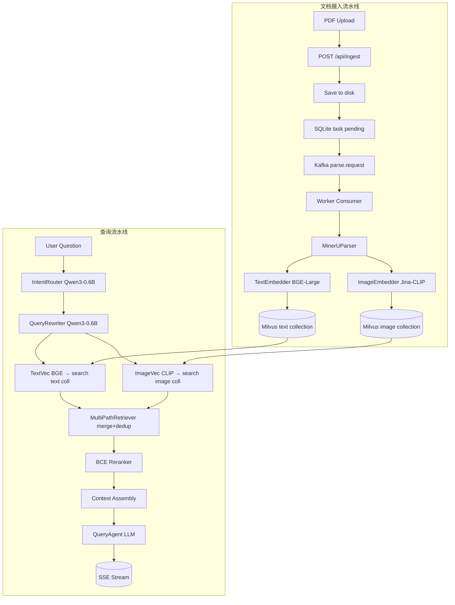

# multiDal — 多模态 RAG 系统架构设计

## 项目背景

企业数字化转型中，核心知识资产不再局限于纯文本。PDF 报告、扫描件、财务图表、设计图稿等多模态文档需要深度语义理解。传统文本 RAG 和 OCR 技术存在局限性：无法把握图表数据趋势、图像对象关系及复杂版面结构，缺乏跨模态检索能力。

MultiDal 摄入 PDF，提取文本与视觉内容，构建跨模态向量数据库，通过 LLM 实现图文混合问答，支持**多知识库隔离**与**会话记忆**。

## 系统架构



## 四阶段流水线

| 阶段 | 输入 | 处理 | 输出 |
|------|------|------|------|
| Parser | PDF 文件 | MinerU 云端 API → Markdown + 图片 + 表格 + LaTeX + 版面 JSON | ParsedDocument |
| Embedder | ParsedDocument | 文本: BGE large zh v1.5 (1024d, Moark API) / 图片: Jina CLIP v2 (1024d, Moark API) | EmbeddedChunk list |
| Store | EmbeddedChunk list | 写入 Milvus 双 Collection（text 1024d + image 1024d） | 向量索引 |
| RAG | 用户问题 | KB 路由 → Query 改写 → 双路召回 → BCE-reranker 精排 → LLM 生成 | 带引用的答案 |

## 项目结构

```
multiDal/
├── src/multidal/
│   ├── config/          # Pydantic Settings（configs/settings.yaml）
│   ├── schema/          # Pydantic 数据模型（跨阶段数据契约 + JSON 验证）
│   ├── pipeline/        # Stage 抽象基类 + Orchestrator
│   ├── queue/           # Kafka producer / consumer
│   ├── parser/          # MinerU 云端 API 包装器 + 图表检测
│   ├── embedder/        # 文本向量化(BGE) + 图片向量化(Jina CLIP) + VLCaptioner
│   ├── store/           # MilvusStore + MultiPathRetriever + Reranker
│   ├── db/              # MySQL 模型(parse_tasks, knowledge_bases) + repository
│   ├── agents/          # BaseAgent → QueryAgent / IngestAgent + 会话管理 + 工具函数
│   ├── kb/              # KBManager + IntentRouter(别名) + QueryRewriter(别名)
│   ├── llm/             # 小模型调用封装（Qwen3-0.6B via Moark API）
│   ├── api/             # FastAPI (ingest / status / query / kb / doc / sessions / health)
│   └── utils/           # 图片预处理、日志
├── configs/
│   └── settings.yaml    # 所有配置（pipeline / kafka / milvus / 模型 API / LLM）
├── frontend/            # Vue 3 + Vite 前端 SPA
├── tests/
├── scripts/
├── docker-compose.yml
└── Dockerfile
```

## 核心技术选型

| 组件 | 选择 | 说明 |
|------|------|------|
| 文档解析 | MinerU (magic-pdf) | 云端 API `https://mineru.net`，JWT 认证 |
| 文本 Embedding | BGE large zh v1.5 | 1024 维，Moark API (`/embeddings`) |
| 图片 Embedding | Jina CLIP v2 | 1024 维，Moark API (`/embeddings`)；每张图片产生像素向量+描述向量共 2 条 |
| Rerank | BCE reranker base v1 | Cross-encoder 精排，Moark sentence-similarity API |
| 小模型（路由/改写） | Qwen3-0.6B | 本地小模型，Moark API，`enable_thinking=False` |
| 向量数据库 | Milvus | Docker 容器，端口 19530 |
| 消息队列 | Kafka | Docker Compose 管理 |
| 状态存储 | MySQL | parse_tasks + knowledge_bases + agent_sessions + agent_messages |
| Agent 框架 | openai-agents SDK | 工具调用 + 会话记忆 |
| LLM（问答） | MiniMax-M2.7 | `https://api.minimaxi.com/v1` |
| 前端 | Vue 3 + Vite | Markdown 渲染、LaTeX 公式、SSE 流式、会话管理 |
| 部署 | Docker Compose | 一键启动全部服务 |

## 检索链路

```
用户问题
  → KB 路由（手动指定 kb_ids / IntentRouter Qwen3-0.6B 自动识别）
  → Query 改写（Qwen3-0.6B 将问题分解为 2-3 个子问题）
  → 双路并行召回：
     A: BGE Embedding (1024d) → Milvus {kb}_text collection（语义检索）
     B: Jina CLIP text encoder (1024d) → Milvus {kb}_image collection（跨模态检索）
  → 合并去重（按 kb_id:chunk_id 唯一化，保留最高分）
  → BCE-reranker 精排：
     - 文本候选：调用 sentence-similarity API 获取重排分数
     - 图片候选：直接使用 CLIP 召回分数（不经 API）
     - 全部候选统一排序，取 top-5
  → 上下文组装 → LLM 生成答案（SSE 流式）
```

**关键约束：只存在 A+B 两路召回，不存在 BM25 或"描述反查"路径。**

## 多知识库

- 每个 KB 对应 Milvus 中一对独立的 Collection（`{kb_id}_text` + `{kb_id}_image`，物理隔离）
- MySQL `knowledge_bases` 表维护 KB 元数据（name, description, collection 名称）
- `parse_tasks.kb_id` 关联文档与知识库
- 查询时手动指定 `kb_ids`，或 `auto_route=true` 由 Qwen3-0.6B 小模型自动路由

## 小模型架构（路由 + 改写）

| 模型 | 用途 | 调用方式 |
|------|------|----------|
| Qwen3-0.6B | KB 路由（IntentRouter） | openai-agents SDK Agent，`enable_thinking=False` |
| Qwen3-0.6B | 查询改写（QueryRewriter） | openai-agents SDK Agent，`enable_thinking=False` |
| Qwen3-0.6B | 会话命名 | openai-agents SDK Agent，`enable_thinking=False` |

**工具注册**：路由 Agent 挂载了 `search_knowledge_base` 和 `get_doc_info` 两个函数工具，支持小模型在实际 KB 数据上下文中做路由决策。

## 图片双路编码

每张图片产生 **2 个 chunk** 存入 `{kb}_image` collection：

| chunk_id | content | modality | 向量来源 |
|----------|---------|----------|----------|
| `img_abc123` | "收益趋势折线图..." | image | Jina CLIP image encoder（像素→1024d） |
| `img_abc123_desc` | "收益趋势折线图..." | image | Jina CLIP text encoder（描述文字→1024d） |

`_load_image_uri`：读取磁盘图片 → 缩放到 max 168px → JPEG 质量 30 → base64 data URI → CLIP image encoder

**查询时向量分发**：

| 查询内容 | 使用模型 | 目标 Collection |
|----------|---------|-----------------|
| 文本 query | BGE Embedding | `{kb}_text` |
| 文本 query（搜图库） | Jina CLIP text enc | `{kb}_image` |

Query 文本同时走 A 路（BGE→text collection）和 B 路（CLIP→image collection），结果合并去重。

## 会话管理

MySQL `agent_sessions` + `agent_messages` 表持久化（独立于主数据库）：

```sql
agent_sessions: session_id(PK), session_name, created_at, updated_at
agent_messages: id(PK), session_id(FK), message_data(JSON), sources(JSON), created_at
```

首个问题回答完成后，Qwen3-0.6B 小模型自动生成会话名称（3-10 汉字），存入 `agent_sessions.session_name`。

## 解析可靠性

MySQL `parse_tasks` 表实时跟踪状态（pending → processing → completed / failed / exhausted）。失败自动重传 Kafka（退避 30s → 60s → 90s），超过 `max_retries` 标记 exhausted。

## 配置

单一配置文件 `configs/settings.yaml`，通过 Pydantic Settings 加载，环境变量可覆盖：

| Section | 用途 |
|---------|------|
| `pipeline` | top_k_recall (default 10), top_k_final (default 5), max_retries (default 3) |
| `kafka` | bootstrap_servers, topic |
| `milvus` | host, port |
| `db` | mysql_host/port/user/password/database（**已从 SQLite 迁移到 MySQL**） |
| `mineru` | api_base, api_token, model_version |
| `text_embedding` | api_base, api_key, model (bge-large-zh-v1.5), dim (1024) |
| `image_embedding` | api_base, api_key, model (jina-clip-v2), dim (1024), device |
| `reranker` | api_base, api_key, model (bce-reranker-base_v1) |
| `vl_caption` | api_base, api_key, model (Qwen2.5-VL-7B-Instruct) |
| `llm` | api_key, base_url, model (MiniMax-M2.7) |
| `small_llm` | model (Qwen3-0.6B) |
| `log` | level |

## LLM 策略

不要求多模态模型。图片内容以 MinerU 生成的**文字描述 caption** 传入 LLM，任何文本 LLM 均可使用。

## API 路由总览

| 方法 | 路径 | 说明 |
|------|------|------|
| `POST` | `/api/ingest` | 上传 PDF（form-data: file + kb_id） |
| `GET` | `/api/ingest/{task_id}` | 查询处理进度 |
| `POST` | `/api/query` | 问答（非流式） |
| `POST` | `/api/query/stream` | 问答（SSE 流式，先推送 sources 再推送 delta） |
| `POST` | `/api/kb/create` | 创建知识库 |
| `GET` | `/api/kb/list` | 列出知识库 |
| `DELETE` | `/api/kb/{kb_id}` | 删除知识库 |
| `GET` | `/api/kb/{kb_id}/docs` | 列出知识库文档 |
| `GET` | `/api/docs/{task_id}` | 查看文档完整内容 |
| `DELETE` | `/api/docs/{task_id}` | 删除文档 |
| `GET` | `/api/sessions` | 列出会话历史 |
| `POST` | `/api/sessions` | 创建新会话 |
| `GET` | `/api/sessions/{id}` | 获取会话信息 |
| `PATCH` | `/api/sessions/{id}` | 重命名会话 |
| `DELETE` | `/api/sessions/{id}` | 删除会话 |
| `GET` | `/api/sessions/{id}/messages` | 获取会话消息历史 |
| `GET` | `/api/health` | 健康检查（Milvus / Kafka / MinerU / Embedding / Reranker / LLM） |